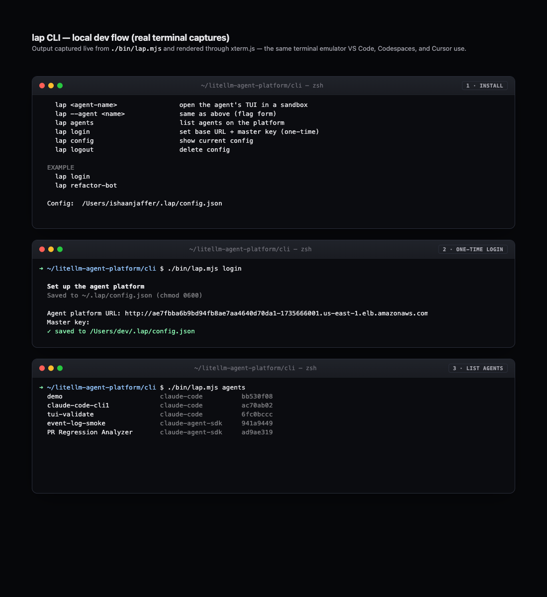
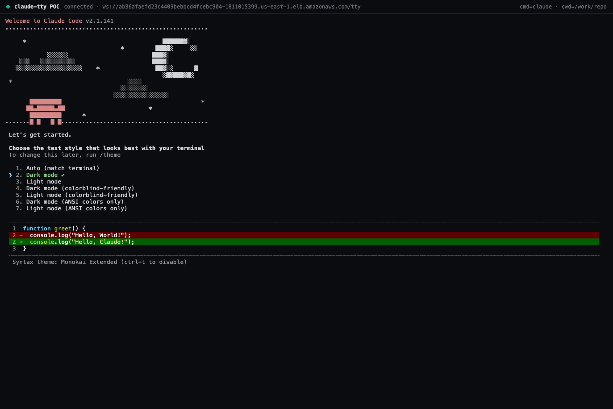

# Claude Code in a sandbox — the `lap` CLI

A single terminal command spins up a managed sandbox running the real
Claude Code CLI, attaches your local terminal to its PTY over a
WebSocket, and hands credentials to the agent as stub placeholders that
vault swaps for the real values at egress.

Same feel as `ssh`. Your iTerm / tmux / wezterm stays exactly where it is.



---

## Prerequisites

- Node 18 or newer
- A running LiteLLM Agent Platform deployment with at least one agent on
  the `claude-code` harness ([create one in the UI](../README.md#agents)).
- The platform's base URL and master key.

## Install from source

```bash
git clone https://github.com/BerriAI/litellm-agent-platform.git
cd litellm-agent-platform/cli
npm install
chmod +x bin/lap.mjs
# Optional: put it on your PATH
ln -sf "$PWD/bin/lap.mjs" /usr/local/bin/lap
```

## Configure (one-time)

```bash
lap login
#   Agent platform URL: https://lap.acme.dev
#   Master key:         ••••••••••••••••
#   ✓ saved to ~/.lap/config.json
```

Config is written with mode `0600`. To clear it: `lap logout`.

## Spin up a sandbox

```bash
lap claude-code-cli1
```

What happens:

1. `GET /api/v1/managed_agents/agents` resolves the name to an agent ID.
2. `POST /agents/:id/session` creates the session.
3. Polls `GET /sessions/:id` until `status=ready`.
4. Reads `sandbox_url` + `tty_token` from the response.
5. Opens `ws://<sandbox_url>/tty` with the `tty_token` sent as an
   `Authorization: Bearer <token>` header on the WS upgrade handshake.
   The header form keeps the token out of ingress/proxy/load-balancer
   access logs that record the request line.
6. Sets the local terminal to raw mode and pipes bytes both directions.
   `SIGWINCH` is forwarded so the remote PTY tracks your window size.

Press **Ctrl-D** to detach. The remote session stays alive — the platform
reaps it after 24h of message inactivity, and you can reconnect by
running `lap claude` again (planned: `lap attach <session-id>`).

Once attached, the local terminal becomes the sandbox's terminal. Real
Claude Code v2.1.141, real PTY, real ANSI rendering — streamed over a
WebSocket from an EKS pod:



## What's running in the sandbox

- The actual `claude` CLI under `node-pty`.
- Working tree at `/work/repo`, optionally cloned at boot from
  `REPO_URL`.
- Credentials in the pod's env are stub placeholders:
  ```
  GITHUB_TOKEN=stub_github_a8f1
  LITELLM_API_KEY=stub_litellm_bb20
  ```
  Vault swaps them for the real values inline on every outbound TLS
  connection. The agent process literally cannot see the real tokens —
  it can `echo $GITHUB_TOKEN` all it wants and only get the stub.

## Troubleshooting

| symptom | likely cause | fix |
|---|---|---|
| `✗ no agent named '…'` | wrong agent name | `lap config` to see what you're authed against; agents are listed in the platform UI |
| `✗ session create failed: 401` | master key wrong | re-run `lap login` |
| `✗ session is in-cluster — no LAP_TTY_FALLBACK set` | platform is deployed with `IN_CLUSTER=true` and hasn't exposed a public WS URL yet | export `LAP_TTY_FALLBACK=ws://host:port/tty` (operator-provisioned) or wait for the planned `tty_url` field on the session response |
| `[ws closed]` immediately after attach | harness pod was reaped or bearer token is wrong | check `lap config`, restart the session |
| upgrade rejected with 401 from the harness | `tty_token` missing or `HARNESS_AUTH_TOKEN` mismatched | confirm the platform's `HARNESS_AUTH_TOKEN` matches the value injected into sandbox pods (`CONTAINER_ENV_HARNESS_AUTH_TOKEN`) |

## Environment overrides

| variable | purpose |
|---|---|
| `LAP_TTY_TOKEN` | override the bearer token (normally read from `session.tty_token`) |
| `LAP_TTY_FALLBACK` | fallback WS URL when `sandbox_url` is in-cluster DNS the laptop can't reach |

## See also

- [`cli/README.md`](../cli/README.md) — CLI internals
- [`harnesses/claude-code/README.md`](../harnesses/claude-code/README.md) — harness container + auth model
- [`docs/k8s-backend.md`](k8s-backend.md) — the K8s side of the sandbox
