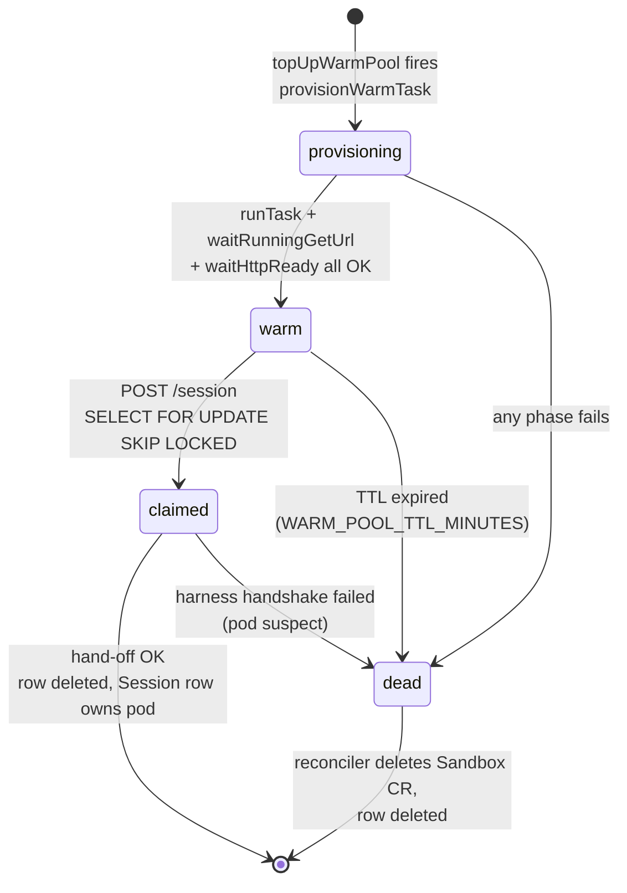
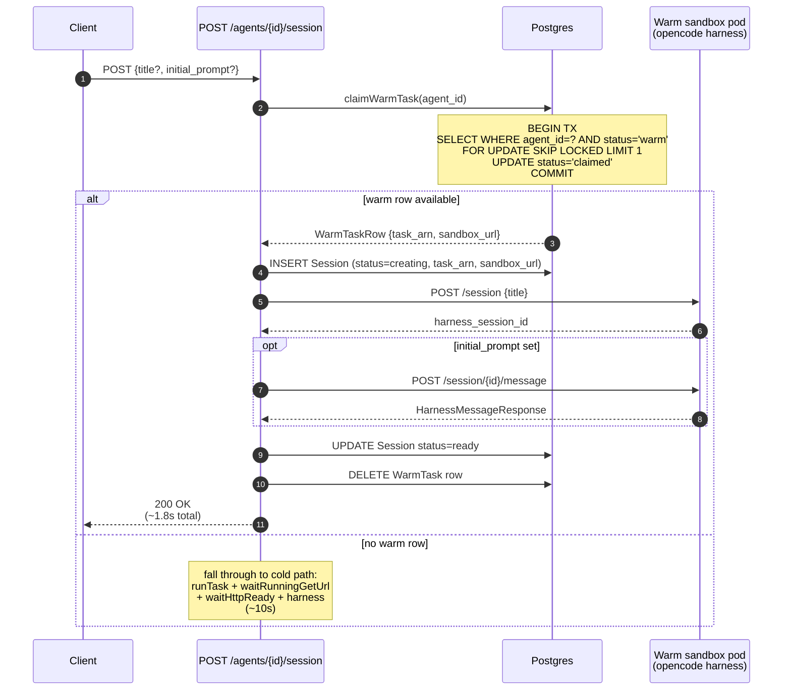
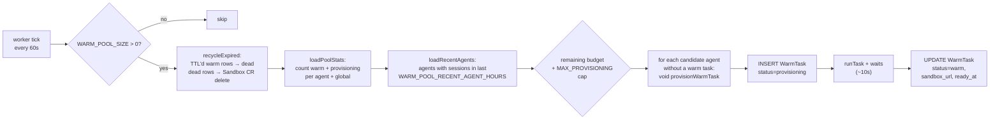

# Warm pool

Pre-provisioned sandbox pods that the platform hands out on `POST /agents/{id}/session`. Removes the ~10s cold-start tax (pod schedule + image pull + opencode boot) from the request path.

## Why this exists

A cold session create runs sequential phases inside the request: Sandbox CR create, controller pod schedule, image pull on the node, container start, opencode HTTP-ready. Live measurements average **~10s** end-to-end on cold k8s spawn, dominated by opencode boot (~8-11s) — see [docs/k8s-backend.md](../../../docs/k8s-backend.md#spawn-time-perf) for the breakdown.

The warm pool moves those phases out of the critical path: a background worker keeps N pods pre-warmed for the most-recently-used agents, and `POST /session` claims one in a single DB round-trip. Happy-path session create drops to **~1.8s** (one harness handshake, one DB write).

## Per-agent constraint

Warm pods **cannot be agent-fungible** — `src/api/k8s.ts:buildContainerEnv` injects `REPO_URL`, `BRANCH`, and `AGENT_PROMPT` as container env at boot, and the opencode harness reads them then. A pod launched for agent A can never serve a request for agent B even if A and B share an image.

So `WarmTask` carries an `agent_id`, and `claimWarmTask(agent_id)` only matches rows for that exact agent. The pool is shared across agents (capped by `WARM_POOL_SIZE` total) but each row is bound to one.

## Components

```
┌────────────────────────────────────────────────────────────────────────────┐
│                                                                            │
│   src/api/warmPool/index.ts                                             │
│   ─────────────────────────────                                            │
│      claimWarmTask(agent_id)        ◄── called from POST /session          │
│      provisionWarmTask(agent)       ◄── fired by topUpWarmPool             │
│      topUpWarmPool()                ◄── called from worker tick            │
│      deleteClaimedWarmTask          ◄── after successful hand-off          │
│      markClaimedTaskDead            ◄── after failed hand-off              │
│                                                                            │
│   src/api/worker/index.ts                                                      │
│   ───────────────────                                                      │
│      tick(): reconcileOrphans() + topUpWarmPool()                          │
│      runs every RECONCILE_INTERVAL_SECONDS (default 60s)                   │
│                                                                            │
│   src/api/reconcile.ts                                                  │
│   ────────────────────────                                                 │
│      sweepWarmOrphans(): deletes Sandbox CRs whose WarmTask row is gone    │
│                                                                            │
│   prisma/schema.prisma                                                     │
│   ─────────────────────                                                    │
│      model WarmTask { warm_task_id, agent_id, status, task_arn,            │
│                       sandbox_url, created_at, ready_at, claimed_at }      │
│                                                                            │
└────────────────────────────────────────────────────────────────────────────┘
```

`task_arn` on the WarmTask row is the Sandbox CR name on the k8s side.

## Lifecycle



## Request path — claim flow



## Background path — top-up loop



## Configuration

All knobs live on `env` (read from process env at startup, see `src/api/env.ts`).

| env var | default | meaning |
|---|---|---|
| `WARM_POOL_SIZE` | `2` | total warm + provisioning rows. `0` disables the feature entirely (`claimWarmTask` short-circuits to `null`, `topUpWarmPool` short-circuits to a no-op). |
| `WARM_POOL_MAX_PROVISIONING` | `2` | concurrency cap on the top-up loop — at most this many `provisionWarmTask` calls fire per tick. Avoids hammering the apiserver when the pool fully drains. |
| `WARM_POOL_TTL_MINUTES` | `30` | warm rows older than this are recycled by `recycleExpired`. Bounds the staleness of pods (image rotation, harness state, etc.). |
| `WARM_POOL_RECENT_AGENT_HOURS` | `24` | only agents that created a session within this window are candidates for warming. Prevents the pool from burning capacity on agents the user has stopped using. |

### Sizing

The pool needs to absorb the burstiest minute of session creates; below that, you fall through to the cold path.

```
WARM_POOL_SIZE  ≥  peak_creates_per_minute  ×  (10s / 60s)  ×  safety_factor
```

Each warm slot consumes the pod's resource requests against cluster capacity (default `100m` CPU / `256Mi` memory — see [docs/k8s-backend.md](../../../docs/k8s-backend.md#pod-resource-requests)). Size against node headroom, not just dollars.

## Failure modes

| failure | what happens |
|---|---|
| `provisionWarmTask` fails (apiserver error, image pull timeout, opencode never replies) | row marked `dead`; reconciler deletes the Sandbox CR on next sweep; next tick provisions a replacement. |
| Operator deletes a `WarmTask` row out from under the worker | `sweepWarmOrphans` (in `reconcile.ts`) finds the Sandbox CR labelled `litellm-warm-task-id=...` with no DB row and deletes it; respects `RECONCILE_NEW_TASK_GRACE_MS` so freshly launched pods aren't killed before their row commits. |
| Reconciler ticks after a successful claim (WarmTask row deleted, Sandbox CR still labelled warm) | `sweepWarmOrphans` cross-checks `Session.task_arn` for every warm-labelled CR before deleting anything. A live (non-DEAD) Session that owns the name means the pod was claimed and is serving the request — the reconciler skips it. Without this guard, the post-claim window would kill the user's pod on the next tick. |
| Harness handshake fails after claim | `Session` row marked `failed`, `WarmTask` row marked `dead` (the pod is suspect — handing the same one out again would just fail). User retries → next attempt either claims a different warm pod or falls through to cold. |
| Concurrent claims for the same warm row | `SELECT … FOR UPDATE SKIP LOCKED` guarantees only one transaction wins. The loser sees `null` and falls through to the cold path. |
| `claimed` row is never deleted (process crash between claim and delete) | once the corresponding Session goes DEAD (e.g. via `SESSION_CREATING_TIMEOUT_MS`), the cross-check no longer protects the name, and the reconciler treats `claimed` as terminal and deletes the Sandbox CR. |

## Observability

Worker logs one line per tick when there's anything to report:

```
warm_pool: provisioned=2 recycled=0 fallback_dead=0
```

Useful Postgres queries:

```sql
-- pool depth right now
SELECT status, COUNT(*) FROM managed_agent_warm_task GROUP BY status;

-- which agents are warmed
SELECT agent_id, status, COUNT(*) FROM managed_agent_warm_task
GROUP BY agent_id, status ORDER BY agent_id;

-- mean time-to-warm
SELECT AVG(EXTRACT(EPOCH FROM (ready_at - created_at)))
FROM managed_agent_warm_task WHERE ready_at IS NOT NULL;
```

## Operational notes

- **Image rotation.** Pushing a new harness image doesn't invalidate live warm pods — they keep running the old image until `WARM_POOL_TTL_MINUTES` recycles them. For an immediate cutover, run `UPDATE managed_agent_warm_task SET status='dead' WHERE status='warm'` and the next tick will both delete the old Sandbox CRs and provision replacements.
- **Multiple worker instances.** `topUpWarmPool` is safe under concurrent execution — `provisionWarmTask` inserts a row before launching the pod, so the next worker's `loadPoolStats` sees the in-flight provision and doesn't double-fire. `claimWarmTask` uses `SKIP LOCKED` for the same reason.
- **Fresh deploy.** A brand-new deploy starts with an empty pool. The first session create for any agent is cold; the worker tick after that session is committed sees the agent as "recently active" and starts warming. Steady state kicks in after ~1 minute.
